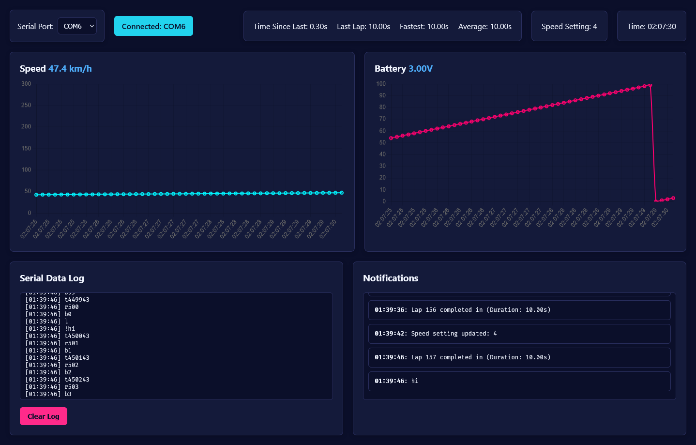

asa gen

protocoul e bazat pe datele primite de la serial

mesajele sunt identificate dupa primul caracter

| caracter | descriere |
|---|---|
|t | time update |
|l | lap time update |
|! | notificare (si daca incepe cu !! atunci e eroare) |
|r | rpm update |
|b | battery update |
|s | speed setting update |

sample rust code

```rust
#[main]
fn main() -> ! {
    let config = esp_hal::Config::default().with_cpu_clock(CpuClock::max());
    let peripherals = esp_hal::init(config);

    let mut uart = Uart::new(peripherals.UART0, Config::default()).unwrap()
        .with_rx(peripherals.GPIO3) 
        .with_tx(peripherals.GPIO1);

    let start_time = Instant::now();
    let mut i = 0;
    
    loop {
        i += 1;
        let elapsed = start_time.elapsed();

        uart.write_fmt(format_args!("t{}\n", elapsed.as_millis())).unwrap();
        uart.write_fmt(format_args!("r{}\n", i%1000)).unwrap();
        uart.write_fmt(format_args!("b{}\n", i%100)).unwrap();

        if i%93 == 0 {
             uart.write_fmt(format_args!("s{}\n", i%5)).unwrap();
        }
        if i%100 == 0 {
             uart.write_fmt(format_args!("l\n")).unwrap();
        }
        if i%150 == 0 {
             uart.write_fmt(format_args!("!hi\n")).unwrap();
        }
        let delay_start = Instant::now();
        while delay_start.elapsed() < Duration::from_millis(100) {}
    }
}
```